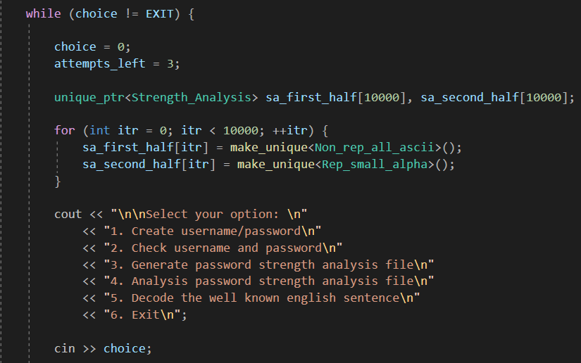

## Portfolio

<div align = "right">
            <a href="https://github.com/Faizanshah007">GitHub</a>
            <a href="https://www.linkedin.com/in/faizanshah-ansari-gamedev/">LinkedIn</a>
        </div>
        <br>
<table>
  <tr>
    <td><h3>
      <li><a href="https://github.com/Faizanshah007/Advanced-Programming-for-Games">Collatz Password Manager</a></li>
      <br>
      </h3></td>
    <td><h3>
      <li><a href="https://github.com/Faizanshah007/Advanced-Graphics-for-Games">Tropical Island</a></li>
      <br><iframe width="560" height="315" src="https://www.youtube.com/embed/HFE6a5WwDNY" title="YouTube video player" frameborder="0" allow="accelerometer; autoplay; clipboard-write; encrypted-media; gyroscope; picture-in-picture" allowfullscreen></iframe>
      </h3></td>
  </tr>
  <tr>
    <td><h3>
      <li><a href="https://github.com/Faizanshah007/Advanced-Game-Technologies">Game Engine C++ (Physics)</a></li>
      <br><iframe width="560" height="315" src="https://www.youtube.com/embed/gsKQjHwSaQw" title="YouTube video player" frameborder="0" allow="accelerometer; autoplay; clipboard-write; encrypted-media; gyroscope; picture-in-picture" allowfullscreen></iframe>
      </h3></td>
    <td><h3>
      <li><a href="https://github.com/Faizanshah007/Fight_My_Demon">Fight_My_Demon</a></li>
      <br><iframe width="560" height="315" src="https://www.youtube.com/embed/nv7ANnlrZOc" title="YouTube video player" frameborder="0" allow="accelerometer; autoplay; clipboard-write; encrypted-media; gyroscope; picture-in-picture" allowfullscreen></iframe>
      </h3></td>
  </tr>
  <tr>
    <td><h3>
      <li><a href="https://github.com/Faizanshah007/Maryo">Maryo</a></li>
      <br><iframe width="560" height="315" src="https://www.youtube.com/embed/nC0HyieDHOg" title="YouTube video player" frameborder="0" allow="accelerometer; autoplay; clipboard-write; encrypted-media; gyroscope; picture-in-picture" allowfullscreen></iframe>
      </h3></td>
    <td><h3>
      <li><a href="https://github.com/Faizanshah007/MindCanvas">MindCanvas</a></li>
      <br><iframe width="560" height="315" src="https://www.youtube.com/embed/gS2ErQcpkzA" title="YouTube video player" frameborder="0" allow="accelerometer; autoplay; clipboard-write; encrypted-media; gyroscope; picture-in-picture" allowfullscreen></iframe>
      </h3></td>
  </tr>
</table>

```markdown
Syntax highlighted code block

# Header 1
## Header 2
### Header 3

- Bulleted
- List

1. Numbered
2. List

**Bold** and _Italic_ and `Code` text

[Link](url) and 
```
