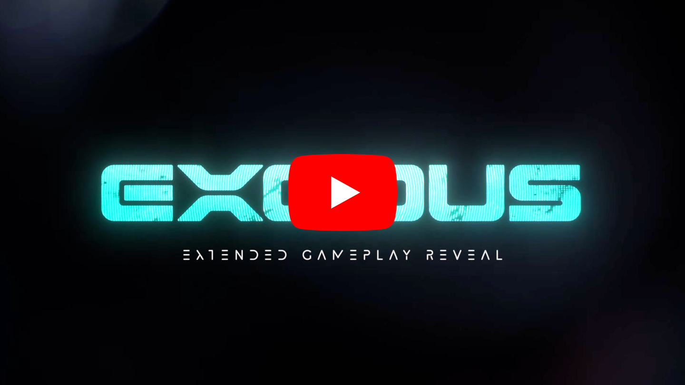
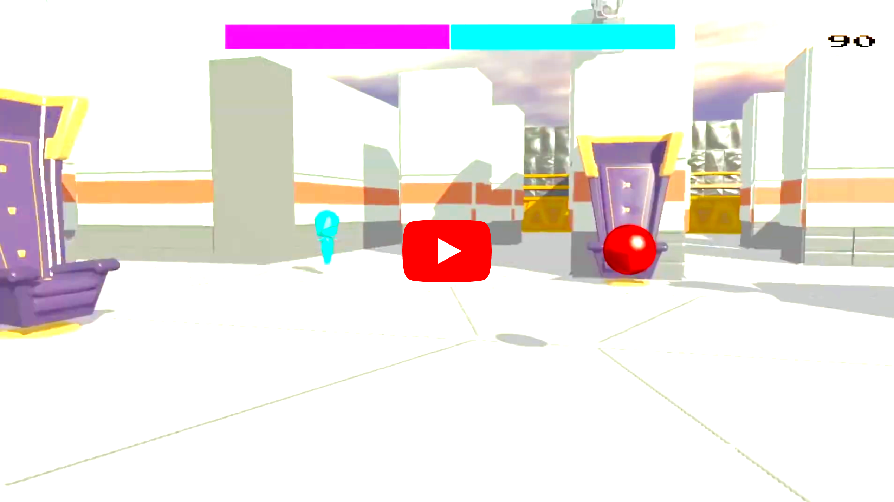
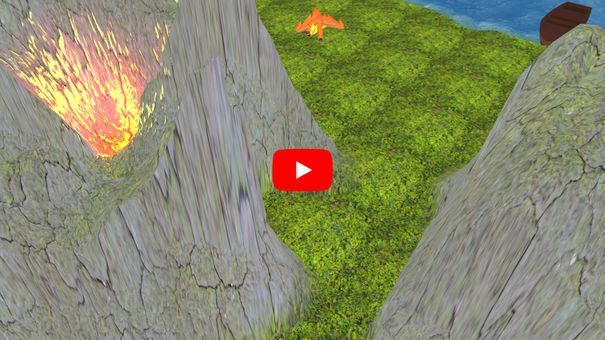
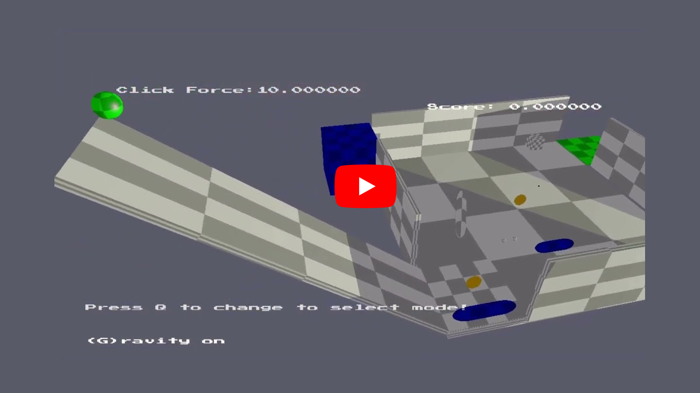

## Portfolio

  <a href="https://github.com/Faizanshah007">GitHub</a>
  |
  <a href="https://www.linkedin.com/in/faizanshah-ansari-gamedev/">LinkedIn</a>

Game programmer focused on designing extensible systems that integrate well with the wider codebase, improving developer workflows and tracking down the bugs that emerge between systems.

  

    

      <button type="button" class="project-tab active" role="tab" aria-selected="true" aria-controls="professional-projects" data-project-tab="professional-projects">Professional Projects</button>
      <button type="button" class="project-tab" role="tab" aria-selected="false" aria-controls="university-projects" data-project-tab="university-projects">University Projects</button>
    

  

  

  <table>
    <tr>
      <td valign="top"><h3>
        <li><a href="https://www.exodusgame.com/en-US">Exodus</a></li>
        
<code>Unreal Engine 5</code> <code>C++</code> <code>Blueprints</code>

        
Gameplay systems, editor tooling and targeted engine improvements.

        <button class="video-thumbnail" type="button" data-video-id="OcED8x2LsXE" data-video-title="Exodus gameplay video" aria-label="Play Exodus gameplay video">
          
        </button>
          
        <iframe width="560" height="315" src="https://www.youtube.com/embed/_c80LMt_Uxs?si=I7aiEYL2_mvS5Kx5&mute=1" title="Exodus additional video" frameborder="0" allow="accelerometer; autoplay; clipboard-write; encrypted-media; gyroscope; picture-in-picture; web-share" referrerpolicy="strict-origin-when-cross-origin" allowfullscreen></iframe>
      </h3></td>
      <td valign="top"><h3>
        <li><a href="https://www.futurlab.co.uk/games/powerwash-simulator-2">PowerWash Simulator 2</a></li>
        
<code>Unity 6</code> <code>C#</code>

        
Game stability, release support, cross-platform multiplayer and split-screen work.

        <iframe width="560" height="315" src="https://www.youtube.com/embed/gP7i0rnNRkE?si=RGg_OystvMY10bKu&mute=1" title="PowerWash Simulator 2 video" frameborder="0" allow="accelerometer; autoplay; clipboard-write; encrypted-media; gyroscope; picture-in-picture; web-share" referrerpolicy="strict-origin-when-cross-origin" allowfullscreen></iframe>
          
        <iframe width="560" height="315" src="https://www.youtube.com/embed/-rLMus-sx1I?si=FZQqSA25SrkkI6O4&mute=1" title="PowerWash Simulator 2 additional video" frameborder="0" allow="accelerometer; autoplay; clipboard-write; encrypted-media; gyroscope; picture-in-picture; web-share" referrerpolicy="strict-origin-when-cross-origin" allowfullscreen></iframe>
      </h3></td>
    </tr>
  </table>

  <table>
    <tr>
      <td colspan="2" align="center" valign="top"><h3>
        <li><a href="https://github.com/Faizanshah007/Spitoon-TeamProject">Spitoon - Team Project</a></li>
        
<code>Custom Engine</code> <code>C++</code>

        <button class="video-thumbnail" type="button" data-video-id="gx8T80bnTCk" data-video-title="Spitoon team project video" aria-label="Play Spitoon team project video">
          
        </button>
      </h3></td>
    </tr>
    <tr>
      <td valign="top"><h3>
        <li><a href="https://github.com/Faizanshah007/Advanced-Graphics-for-Games">Tropical Island</a></li>
        
<code>Custom Engine</code> <code>C++</code>

        <button class="video-thumbnail" type="button" data-video-id="HFE6a5WwDNY" data-video-title="Tropical Island video" aria-label="Play Tropical Island video">
          
        </button>
      </h3></td>
      <td valign="top"><h3>
        <li><a href="https://github.com/Faizanshah007/Advanced-Game-Technologies">Game Engine (Physics)</a></li>
        
<code>Custom Engine</code> <code>C++</code>

        <button class="video-thumbnail" type="button" data-video-id="g7kDU1J3jcs" data-video-title="Game Engine C++ physics video" aria-label="Play Game Engine physics video">
          
        </button>
      </h3></td>
    </tr>
  </table>

  

